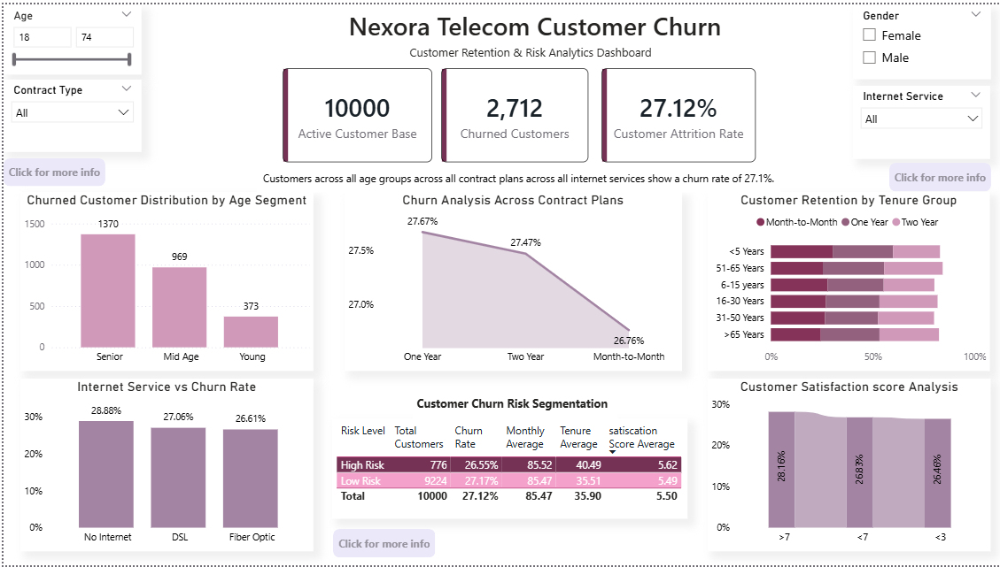
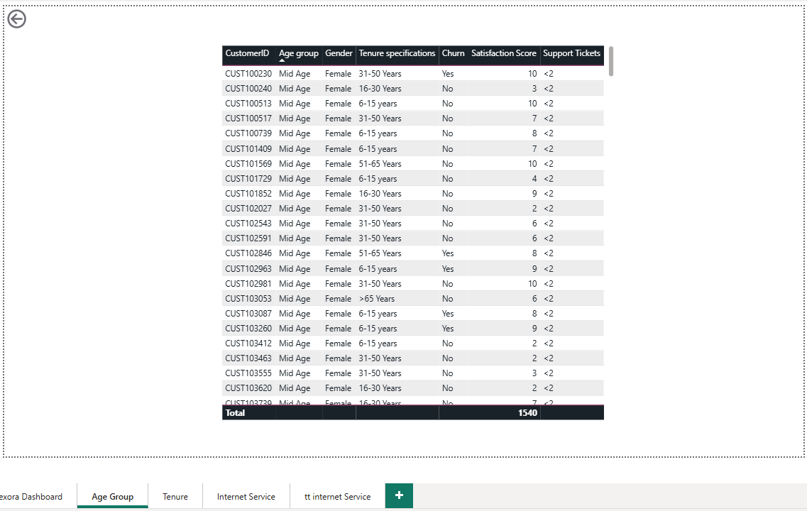
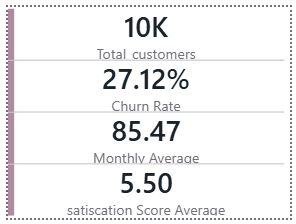
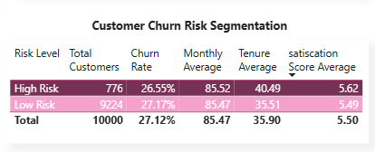

# Nexora Telecom Customer Churn Analysis Dashboard

## Project Overview

This project is an interactive Power BI dashboard developed to analyze customer churn behavior in a telecom company. The dashboard focuses on identifying customer retention patterns, high-risk customer segments, and business factors influencing customer attrition.

Using a dataset containing 10,000+ telecom customer records, the project combines KPI reporting, DAX calculations, dynamic insights, drill-through analysis, and interactive visual storytelling to generate business-oriented insights.

---

## Project Objective

The primary objectives of this project were:

* Analyze customer churn behavior across different customer segments
* Identify factors contributing to higher customer attrition
* Compare churn patterns across contract types, internet services, tenure groups, and demographics
* Build an interactive and business-focused Power BI dashboard
* Improve analytical storytelling and dashboard design skills

---

## Dashboard Features

### KPI Reporting

The dashboard includes key business KPIs such as:

* Total Customers
* Churned Customers
* Customer Attrition Rate

---

### Dynamic Insight Panel

A dynamic insight panel was created using DAX measures to generate real-time analytical insights based on slicer selections and user interaction.

---

### Customer Segmentation Analysis

The dashboard analyzes customer churn behavior based on:

* Contract Type
* Internet Service
* Age Segment
* Tenure Group
* Customer Satisfaction
* Risk Level

---

### Risk Segmentation Table

A customer risk segmentation section was developed using:

* Churn Rate
* Average Monthly Charges
* Average Satisfaction Score
* Average Tenure

Conditional formatting was applied to improve risk visibility and comparative analysis.

---

### Drill-through Analysis

Drill-through pages were implemented to allow detailed customer-level analysis and improve dashboard interactivity.

---

### Custom Tooltips

Interactive report-page tooltips were added to provide deeper contextual insights while hovering over visual elements.

---

## Key Insights Identified

* Overall customer attrition rate was approximately **27.12%**
* Customers under **One Year** demonstrated comparatively higher churn behavior than long-term contract users but Churn rates accross Contract plan remained relatively close from 265 to 28%
* Customers using **No Internet services** showed the highest churn rate at approximately **28.88%**
* Churn rates across age groups remained relatively close, highlighting the importance of normalized analysis instead of relying only on customer counts
* Risk segmentation analysis indicated that customer churn is influenced by multiple combined business factors rather than a single variable

---

## Tools & Technologies Used

* Power BI
* DAX 
* Power Query
* KPI Reporting
* Drill-through & Tooltips
* Conditional Formatting
* Interactive Dashboard Design

---

## Skills Demonstrated

* Data Visualization
* Dashboard Storytelling
* Customer Retention Analysis
* Interactive Dashboard Design
* Analytical Thinking

---

## Repository Contents

* `.pbix` Power BI Dashboard File
* Dataset CSV File
* Dashboard Screenshots
* README Documentation

---

## Dashboard Preview

### Main Dashboard

---

### Age Group Drill-through Page

---

### Tooltip Analysis

---

### Risk Segmentation Analysis

## Learning Outcome

One of the most valuable learnings from this project was understanding the difference between analyzing raw customer counts and normalized churn rates. This project also helped strengthen my understanding of KPI storytelling, interactive reporting, and business-focused dashboard design.

---

## Author

**Shreya Shettigar**
Email : shettigarr.shreya
LinkedIN : www.linkedin.com/in/shreya-shettigar-5b16a6378

